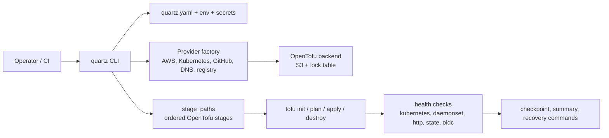

# Capability Summary

`quartzctl` is a reusable platform automation CLI for projects that are too complex for one monolithic OpenTofu root module and too important to operate with ad hoc shell scripts. It provides a single `quartz` command that loads a declarative `quartz.yaml`, discovers ordered stage directories, prepares the cloud state backend, runs OpenTofu per stage, and gates progress with Kubernetes, HTTP, daemonset, state, and OIDC checks.

## What It Solves

Delivery teams often inherit platform stacks with dozens of dependencies: cloud infrastructure, Kubernetes add-ons, identity providers, GitOps controllers, application infrastructure, secrets, and post-install wiring. Without an orchestrator, teams rely on tribal order-of-operations knowledge, hand-written scripts, and manual state repair.

`quartzctl` captures that order in code:

- Stage discovery from `stage_paths` using directories such as `10-host`, `20-core`, and `30-apps`.
- Dependency-aware install and destroy ordering.
- Stage-scoped variable sourcing from config, secrets, environment variables, and previous stage outputs.
- Health gates before or after apply/destroy/init operations.
- Resumable installs with checkpoint and drift checks.
- Resilient cleanup that continues across stage failures and preserves recoverable state.
- Operational commands for kubeconfig, rendered config, exported resources, stale locks, imports, and state inspection.

## Architecture At A Glance

## Core Capability

| Capability | What quartzctl Provides |
|------------|-------------------------|
| Install orchestration | `quartz install`, dependency-aware stage order, backend preparation, checkpointing |
| Teardown orchestration | `quartz clean`, reverse dependency order, retry and state cleanup behavior |
| Stage operations | `quartz tofu plan/apply/destroy/output/refresh/validate/format` |
| State repair | `quartz tofu import`, `force-unlock`, `state list/show/rm` |
| Health gating | Kubernetes resource readiness, daemonset readiness, HTTP content checks, state checks, OIDC checks |
| Configuration rendering | `quartz render`, `quartz check`, config/env/secrets precedence |
| Cluster operations | `quartz login`, `info`, `refresh-secrets`, `restart`, `export` |
| CI ergonomics | `--yes`, `SILENT`, predictable command output, non-interactive flags |

## Best Fit

Use `quartzctl` when a program needs:

- Repeatable multi-stage infrastructure install and teardown.
- A portable CLI that wraps OpenTofu rather than replacing it.
- A consistent stage contract for multiple delivery teams.
- Operational recovery paths that avoid direct backend surgery.
- Proposal-ready evidence that platform setup is automated, documented, and supportable.

## Delivery Assets

This package includes:

- [Reference Architecture](reference-architecture.md)
- [Operating Model](operating-model.md)
- [Onboarding Guide](onboarding-guide.md)
- [Runbook](runbook.md)
- [Troubleshooting Guide](troubleshooting-guide.md)
- [Template Package](template-package.md)
- [Value Brief](value-brief.md)
- [Product Page](product-page.md)
