# Operating Model

> How teams own, run, and evolve projects automated by `quartzctl`.

`quartzctl` works best when the target project treats `quartz.yaml`, stage directories, and generated run output as an operational contract. The CLI provides the repeatable mechanics; the delivery team owns the project-specific stages, provider credentials, and environment decisions.

## Lifecycle

```mermaid
gantt
    title quartzctl lifecycle
    dateFormat X
    axisFormat %s
    section Day 0
    Define config and stages      :a1, 0, 2
    Validate provider access      :a2, 2, 3
    section Day 1
    Install / resume              :b1, 3, 5
    Validate health checks        :b2, 5, 6
    section Day 2+
    Drift-aware reruns            :c1, 6, 8
    State repair / import         :c2, 8, 9
    Teardown / rebuild            :c3, 9, 10
```

## Day 0 - Prepare

- Choose the target project layout and stage directories.
- Define minimum `quartz.yaml`: `name`, `dns`, `aws`, `github`, `stage_paths`, `gitops`, and application/auth settings if used.
- Decide where secrets come from: environment variables, a secrets file, or a program secret manager that exports env vars before CLI execution.
- Confirm OpenTofu and cloud credentials are available.
- Run `quartz check` and `quartz render` before the first install.

## Day 1 - Install

`quartz install` prepares the account and state backend, walks stages in dependency order, applies OpenTofu, runs configured checks, and saves checkpoints. Re-running `quartz install` is the normal recovery path: checkpointed stages are checked for drift and skipped only when still in sync.

Operators should keep the first install transcript, rendered config, and any stage-specific outputs as delivery evidence.

## Day 2+ - Operate

Common day-2 work:

- Re-run `quartz install --yes` after config or stage changes.
- Use `quartz install --resume-from <stage> --yes` when a known stage needs focus.
- Use `quartz tofu plan --stage <stage> --init` before risky changes.
- Use `quartz tofu state list/show/rm` and `quartz tofu import` for controlled state repair.
- Use `quartz login`, `info`, `refresh-secrets`, `restart`, and `export` for cluster-adjacent operations.
- Use `quartz clean --yes` for teardown and repeat until the final report is clean.

## Sources Of Truth

| Concern | Source of Truth |
|---------|-----------------|
| Environment identity | `quartz.yaml` `name`, `project`, `dns`, `aws` |
| Stage order and dependencies | Stage directory prefix plus `stage.yaml` `dependencies` |
| Infrastructure resources | OpenTofu stage directories |
| Stage inputs | `stage.yaml` `vars` plus rendered config and secrets |
| Health gates | `stage.yaml` `checks` |
| Destroy behavior | `stage.yaml` `destroy` include/exclude/skip |
| Rendered operator view | `quartz render` output |
| Remote state | Provider-created OpenTofu backend |

## RACI

| Activity | Platform Engineering | Delivery Team | Security / ISSO | Capture / PM |
|----------|----------------------|---------------|-----------------|--------------|
| CLI changes | R/A | C | I | I |
| Project stage design | C | R/A | C | I |
| Environment config | C | R/A | C | I |
| Secrets and credentials | C | R/A | C | I |
| First install | C | R/A | I | I |
| Health-check design | R | R/A | C | I |
| State repair | R | R/A | I | I |
| Teardown | C | R/A | I | I |
| Proposal language | C | C | C | R/A |

## Release And Change Management

- CLI changes should include unit tests for command behavior and config parsing when feasible.
- Project changes should be validated with `quartz render` and a targeted `quartz tofu plan`.
- Add or change stage health checks with the same care as application readiness probes: short checks create false failures; overly broad checks hide root causes.
- Keep `stage.yaml` destroy filters current so teardown remains recoverable.
- Prefer `quartz tofu import` and `state rm` over manually editing backend state.

## Operational Evidence

Useful evidence for delivery reviews:

- `quartz --version`
- `quartz render --out ./out/quartz.generated.yaml`
- `quartz check` output
- Stage plan/apply logs
- `quartz info` output after install
- Cleanup report produced by failed or completed `quartz clean`

## Review Cadence

Review this operating model when:

- New root commands or flags are added.
- Stage schema changes.
- Provider behavior changes.
- Clean/install retry behavior changes.
- A program adds a new class of health check or state repair procedure.
