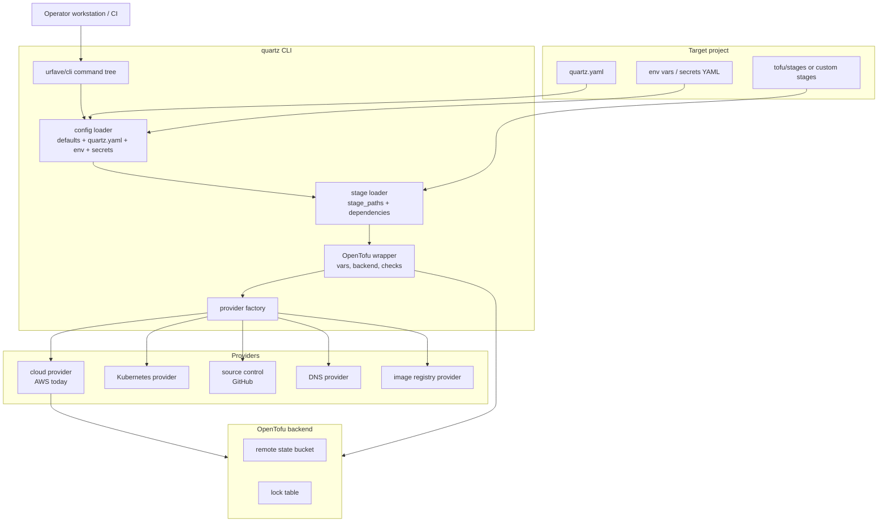
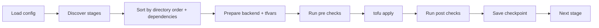

# Reference Architecture

> `quartzctl` architecture, command surface, stage lifecycle, provider boundaries, and security model.

`quartzctl` builds the `quartz` binary. The CLI reads `quartz.yaml`, merges defaults and environment input, loads optional secrets, discovers stage directories, and executes OpenTofu operations against those stages with provider-aware preparation and health gates.

## System Architecture

## Component Map

| Component | Role | Source |
|-----------|------|--------|
| CLI root | Defines `quartz`, global flags, command registration | `internal/cmd/cli.go` |
| Install/clean engine | Full lifecycle orchestration, checkpointing, retry and cleanup behavior | `internal/cmd/install.go` |
| Utility commands | `login`, `info`, `check`, `render`, `refresh-secrets`, `export`, `restart` | `internal/cmd/util.go` |
| OpenTofu commands | `tofu`/`tf` subcommands, state, import, force-unlock | `internal/cmd/tofu.go` |
| Config loader | Defaults, env precedence, secrets, DNS/GitOps/app defaults | `internal/config` |
| Config schema | Authoritative `quartz.yaml` structs | `internal/config/schema` |
| Stage loader | Stage directory parsing, dependency ordering | `internal/stages` |
| OpenTofu client | `terraform-exec` wrapper for init/plan/apply/destroy/state | `internal/tofu` |
| Providers | AWS, Kubernetes, GitHub, Cloudflare/DNS, registry helpers | `internal/provider` |

## Command Surface

| Command | Purpose |
|---------|---------|
| `quartz check` | Check environment, configuration, and provider access |
| `quartz install [--resume-from <stage>] [--allow-deferral] [--yes]` | Run full install/update |
| `quartz clean [--yes]` | Run full teardown |
| `quartz info` | Print cluster, HelmRelease, SSO, and application summary where available |
| `quartz login [--out <path>]` | Generate or refresh kubeconfig |
| `quartz render [--out <path>]` | Write fully rendered config |
| `quartz refresh-secrets` | Force ExternalSecret refresh |
| `quartz restart` | Restart Kubernetes workloads by kind/namespace/name |
| `quartz export` | Export configured Kubernetes resources to YAML |
| `quartz tofu ...` or `quartz tf ...` | Stage-level OpenTofu operations |

Hidden internal commands support kubeconfig exec credential flow and emergency cleanup:

- `quartz aws get-eks-token --cluster <name> --region <region>`
- `quartz internal force-cleanup`
- `quartz internal cleanup-terminating-pods`

## Stage Lifecycle

Stages are discovered from `stage_paths` by directory convention. A folder such as `20-core` becomes stage id `core` with order `20`. A `stage.yaml` file can override fields such as `description`, `dependencies`, `vars`, `providers`, `checks`, `destroy`, `flux`, and `debug`.

## Configuration Model

`quartzctl` loads configuration in this order:

1. Built-in defaults from `internal/config/schema`.
2. Environment variables prefixed with `QUARTZ_`.
3. `quartz.yaml`.
4. Computed defaults for DNS, GitOps, core apps, application environments, and auth.
5. Stage definitions from `stage_paths`.
6. A second `QUARTZ_` environment pass for final precedence.

Credentials are loaded from common environment variables (`GITHUB_TOKEN`, `IRONBANK_PASSWORD`, `CLOUDFLARE_API_TOKEN`, and related aliases) and optional secrets YAML via `--secrets`.

## Stage Variable Sources

| Source | Example |
|--------|---------|
| Literal value | `value: us-east-1` |
| Environment | `env: GITHUB_TOKEN` |
| Config | `config: dns.domain` |
| Secret | `secret: github.token` |
| Prior stage output | `stage: { name: host, output: vpc.vpc_id }` |

Sensitive variable names are redacted in debug logs when they look like tokens, passwords, secrets, private keys, credentials, or API keys.

## Health Checks

| Check | Purpose |
|-------|---------|
| `kubernetes` | Wait for resources such as Deployments, HelmReleases, Certificates, or CRDs |
| `daemonset` | Confirm daemonset readiness across nodes |
| `http` | Poll endpoints and validate status codes or JSON content |
| `state` | Check installer state keys |
| `oidc` | Validate OIDC client secret and token endpoint wiring |

Checks can run before or after `apply`, `destroy`, or `init`, and can be ordered within a stage.

## Security Boundaries

- Secrets are separated from rendered config via `QuartzSecrets` and optional secrets files.
- Common secret-looking variable names are redacted from debug logs.
- Kubeconfig generation uses the CLI as an EKS exec credential plugin.
- `tofu state show` redacts sensitive state values before printing.
- Destructive operations keep confirmation prompts unless `--yes` or `SILENT` is used for CI.
- Failed clean operations preserve the backend until all stage destroys succeed, keeping state recoverable.

## Runtime Dependencies

`quartzctl` is a Go CLI. Development tooling is managed by `mise.toml` and includes Go 1.26, GoReleaser, golangci-lint, gosec, gitleaks, and pre-commit. The target project supplies OpenTofu, cloud credentials, and any cluster tools required by its stages.
