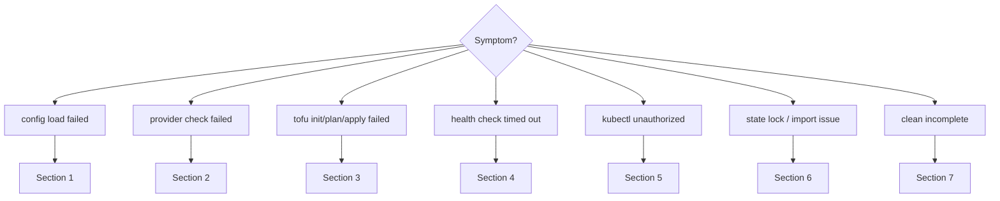

# Troubleshooting Guide

> Decision-tree diagnosis for `quartzctl` configuration, provider, OpenTofu, health-check, and teardown issues.

Start with the symptom that matches. Most failures are configuration input, provider access, stage ordering, OpenTofu backend/state, or a health gate timing out.

## Triage Flow



## 1 - Config Load Failed

Common symptoms:

- `at least one of dns.zone or dns.domain must be specified`
- Wrong domain rendered
- Stage not found
- Stage paths appear empty

Checks:

```bash
quartz render --out ./out/quartz.generated.yaml
```

Fixes:

- Set either `dns.zone` or `dns.domain`.
- Confirm `name` is set; it is used to derive `dns.domain` when only `dns.zone` is provided.
- Confirm `stage_paths` points at real directories from the project root.
- Confirm stage folders follow `<order>-<id>` naming, such as `10-host`.
- Confirm `--config` points at the intended file.

## 2 - Provider Check Failed

Symptoms:

- `quartz check` reports missing provider access.
- AWS calls fail before any stage runs.
- GitHub or registry access fails.

Checks:

```bash
aws sts get-caller-identity
env | grep -E 'AWS|GITHUB|IRONBANK|CLOUDFLARE'
quartz check
```

Fixes:

- Export AWS credentials or run from an instance/profile with sufficient permissions.
- Set `AWS_DEFAULT_REGION` or `aws.region`.
- Set `GITHUB_USERNAME` and `GITHUB_TOKEN` when stages or GitOps wiring need GitHub.
- Set Ironbank or registry credentials when the target project pulls private images.
- Use `--secrets <file>` only for local development and keep it out of Git.

## 3 - OpenTofu Init, Plan, Or Apply Failed

Symptoms:

- Backend cannot initialize.
- Providers cannot configure.
- A stage variable is missing.
- A stage output reference cannot be resolved.

Checks:

```bash
quartz tofu init --stage <stage>
quartz tofu plan --stage <stage>
quartz tofu output --stage <dependency> --init
quartz render --out ./out/quartz.generated.yaml
```

Fixes:

- Confirm the dependency stage completed and has the expected output.
- Confirm `stage.yaml` `vars` references use the correct source: `config`, `secret`, `env`, `value`, or `stage`.
- Confirm `override_vars` is intentional. If false, the generated tfvars file is included.
- Confirm the stage directory contains valid OpenTofu files.
- Use `--allow-deferral` only when the OpenTofu provider requires deferred actions.

## 4 - Health Check Timed Out

Symptoms:

- Stage apply succeeded, but the stage fails during a configured check.
- A Kubernetes/HTTP/OIDC gate never becomes ready.

Checks:

```bash
quartz info
kubectl get pods -A
kubectl get helmrelease -A
kubectl describe <kind> <name> -n <namespace>
```

Fixes:

- Increase `timeout` or retry settings if the resource is legitimately slow.
- Verify `namespace`, `kind`, `name`, and `state` match the actual object.
- For `http` checks, confirm the endpoint, status codes, TLS setting, and content key.
- For `daemonset` checks, confirm enough nodes are schedulable.
- For `oidc` checks, confirm the secret path and client credentials exist.

## 5 - `kubectl` Unauthorized Or Kubeconfig Missing

Symptoms:

- `error: You must be logged in to the server (Unauthorized)`
- Kubeconfig path is stale or missing.
- Exec credential plugin fails.

Checks:

```bash
quartz login
export KUBECONFIG=./out/kubeconfig
kubectl get nodes
```

Fixes:

- Regenerate kubeconfig with `quartz login --out <path>`.
- Confirm the IAM principal is mapped in the cluster access entries.
- Confirm the `quartz` binary is on `PATH`; kubeconfig exec uses the CLI to mint EKS tokens.
- Confirm AWS region and cluster name match the rendered config.

## 6 - State Lock, Missing State, Or Bad State Entry

Symptoms:

- OpenTofu reports a stale lock.
- A resource exists in the provider but is not in state.
- A resource should no longer be managed but should not be destroyed.

Commands:

```bash
quartz tofu force-unlock --stage <stage> LOCK_ID --init
quartz tofu import --stage <stage> ADDRESS ID --init
quartz tofu state list --stage <stage> --init
quartz tofu state show --stage <stage> ADDRESS --init
quartz tofu state rm --stage <stage> ADDRESS --init
```

Fixes:

- Prefer `force-unlock` over manual lock-table edits.
- Import real resources before re-running a plan if apply created them but state was not written.
- Use `state rm` only when OpenTofu should stop managing a resource.
- Re-run `quartz tofu plan --stage <stage>` after state repair.

## 7 - `quartz clean` Incomplete

Symptoms:

- A stage destroy failed.
- Backend still exists.
- A Kubernetes resource blocks deletion.

Expected behavior:

- `clean` continues across stage failures.
- The backend remains until all stages destroy successfully.
- Re-running `quartz clean --yes` is the normal recovery path.

Checks:

```bash
quartz clean --yes
quartz tofu state list --stage <stage> --init
```

Fixes:

- Resolve the failing stage shown in the cleanup report.
- Use targeted `quartz tofu destroy --stage <stage> --init` if you need to isolate a stage.
- Use `state rm` only after confirming the real resource is already gone or should be orphaned.

## Fast Diagnostics

```bash
quartz --version
quartz check
quartz render --out ./out/quartz.generated.yaml
quartz info
quartz tofu version
quartz tofu state list --stage <stage> --init
```

When in doubt, re-run `quartz install --yes` for convergent install state, or use `quartz tofu plan --stage <stage> --init` to isolate a single stage.
